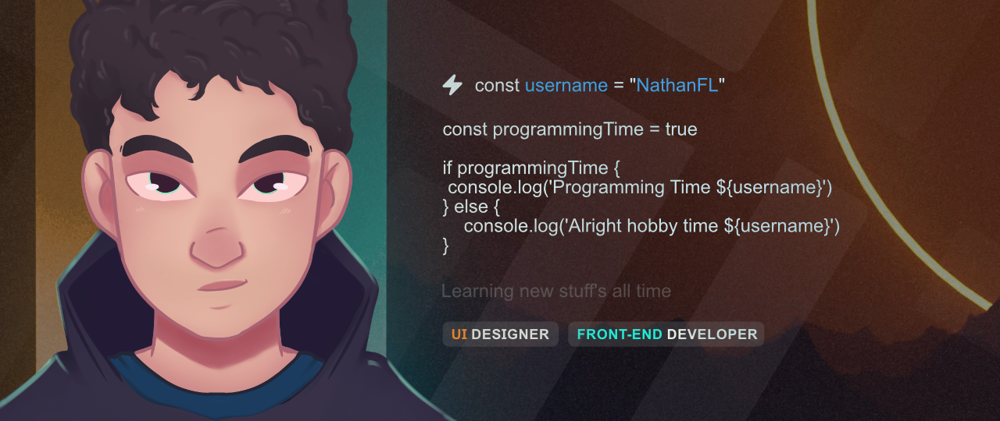

<h1 style="text-align: center;">Hey there, I'm Nathan 👋</h1>

<p>Hello, my name is Nathan and I'm a Front-end and UI Design student. I'm passionate about design, audiovisual and programming, and I've been working as a freelancer for over a year creating lead capture websites, social media posts, and video editing for clients.

I have experience working on web development projects using React and Next.js, and I'm always looking for new challenges and opportunities to learn and contribute to the Github community.

My goals on Github are to share my knowledge and experience, contribute to open-source projects, and learn from the community. Let's build a better world through technology together!

</p>

- 👨‍💻 I'm currently working as a Freelancer
- 🌱 I'm currently learning Front-end and UI Design
- 🤗 My natural language is portuguese
- 🏡 I'm currently living in Brazil

## Skills ⚡

### Programming (include libs, frameworks and tools)

[](https://standardjs.com/)
[](https://standardjs.com/)
[](https://standardjs.com/)
[](https://standardjs.com/)
[](https://standardjs.com/)
[](https://standardjs.com/)
[](https://standardjs.com/)
[](https://standardjs.com/)
[](https://standardjs.com/)

### Design (Programs, and others tools)

[](https://standardjs.com/)
[](https://standardjs.com/)
[](https://standardjs.com/)
[](https://standardjs.com/)
[](https://standardjs.com/)

<!-- <details>
<summary style=""></summary>
```
CODE!
```
</details> -->
